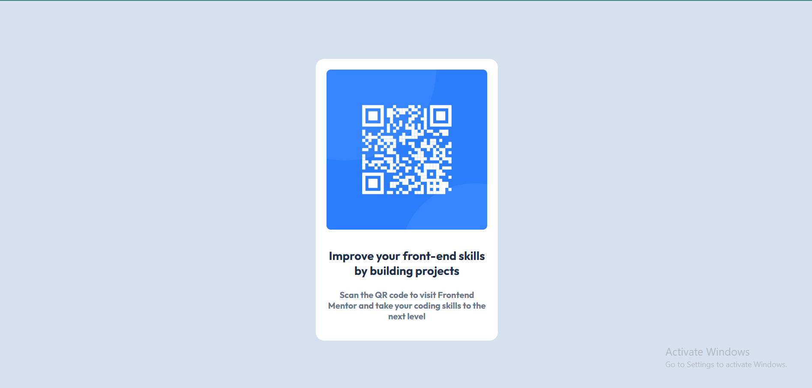

# Frontend Mentor - QR code component solution

This is a solution to the [QR code component challenge on Frontend Mentor](https://www.frontendmentor.io/challenges/qr-code-component-iux_sIO_H). Frontend Mentor challenges help you improve your coding skills by building realistic projects. 

## Overview

### Screenshot

## My process

### Built with

- HTML5 
- CSS custom properties
- Flexbox
- Google Fonts

### Website Link

(https://qrcodechallenge01.netlify.app/)

### What I learned

I learned how to use html and css to create such a card and add images inside a card and align them properly with css properties.

## Author
- Frontend Mentor - [@Jaazib01](https://www.frontendmentor.io/profile/Jaazib01)
